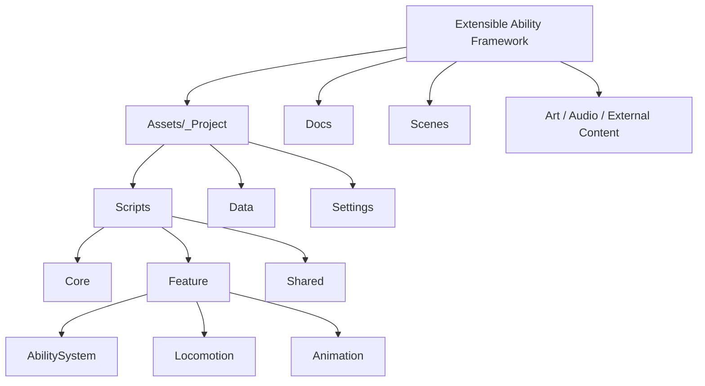
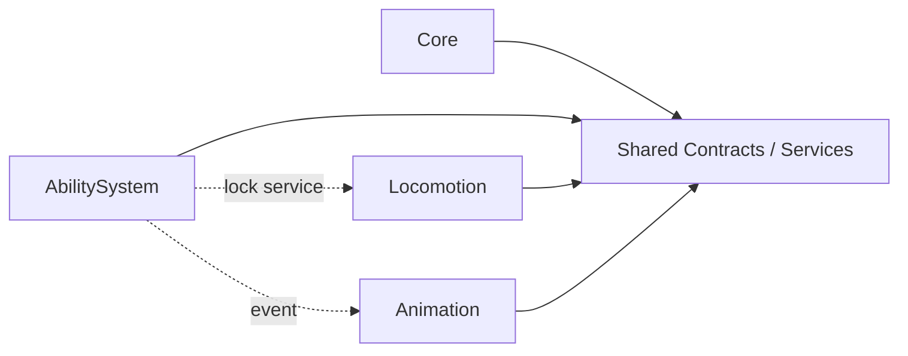

# Project Structure

Bu dokuman, repo klasor yapisini ve katman sinirlarini hizli okumak icin hazirlandi.

## High-Level Structure

## Script Layer Boundaries

## Folder Intent

- `Assets/_Project/_Scripts/Core`
  - Root composition, gameplay scope ve uygulama iskeleti
- `Assets/_Project/_Scripts/Feature`
  - Oyun davranislarinin feature bazli implementasyonlari
- `Assets/_Project/_Scripts/Shared`
  - Birden fazla feature tarafindan kullanilan ortak kontratlar ve servisler
- `Assets/_Project/Data`
  - Authoring asset'leri ve feature verileri
- `Docs`
  - Teknik aciklamalar, feature notlari ve destekleyici dokumanlar

## Current Feature Breakdown

### Ability System

- `Data`
- `Executors`
- `Mechanics`
- `Modules`
- `Runtime`
- `UI`
- `Editor`

### Locomotion

- `Data`
- `Runtime`
- `Input`

### Animation

- `Data`
- `Runtime`

## Notes

- `Shared`, ancak iki veya daha fazla feature icin gercekten ortak hale gelen yapilar icin kullanilir.
- Feature'lar birbirinin implementasyon detayina baglanmaz; iletisim event, interface veya ortak servis kontratlari uzerinden kurulur.
