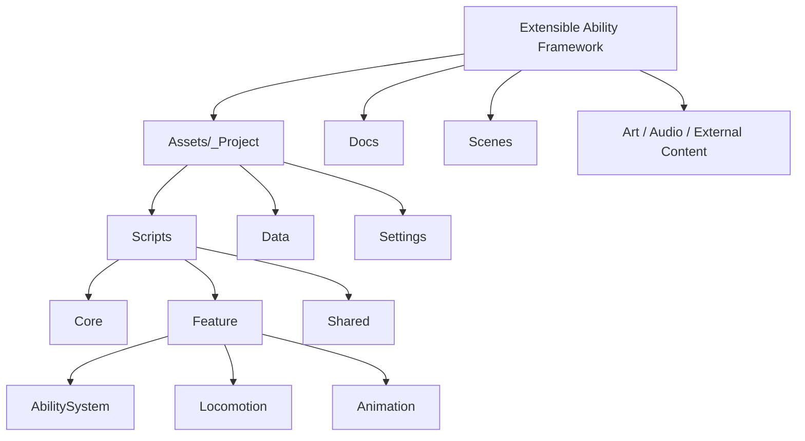
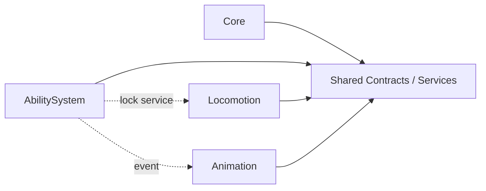

# Project Structure

This document summarizes repository layout and layer boundaries for quick onboarding.

## High-Level Structure

## Script Layer Boundaries

## Assembly Mapping

- `CaseStudy.Core.Runtime` -> composition root and global setup
- `CaseStudy.Shared.Runtime` -> shared contracts, events, reusable infrastructure
- `CaseStudy.Feature.AbilitySystem.Runtime` -> ability runtime and authoring flow
- `CaseStudy.Feature.Locomotion.Runtime` -> locomotion runtime and input
- `CaseStudy.Feature.Animation.Runtime` -> animation driver and binding
- `CaseStudy.Feature.PlayerControl.Runtime` -> player switching and control orchestration

Rule:
- Cross-feature dependencies should flow through `Shared` abstractions whenever possible.
- Assembly separation is used to enforce this boundary at compile time.

## Folder Intent

- `Assets/_Project/_Scripts/Core`
  - Root composition, gameplay scope setup, and application skeleton.
- `Assets/_Project/_Scripts/Feature`
  - Feature-oriented gameplay implementations.
- `Assets/_Project/_Scripts/Shared`
  - Cross-feature contracts and reusable services.
- `Assets/_Project/Data`
  - Authoring assets and feature data.
- `Docs`
  - Technical notes, feature documentation, and validation guides.

## Current Feature Breakdown

### Ability System

- `Data`
- `Executors`
- `Mechanics`
- `Modules`
- `Runtime`
- `UI`
- `Editor`

### Locomotion

- `Data`
- `Runtime`
- `Input`

### Animation

- `Data`
- `Runtime`

## Notes

- `Shared` should only contain systems that are truly reused by two or more features.
- Features should not depend on each other's implementation details; communication should happen through events, interfaces, or shared service contracts.
