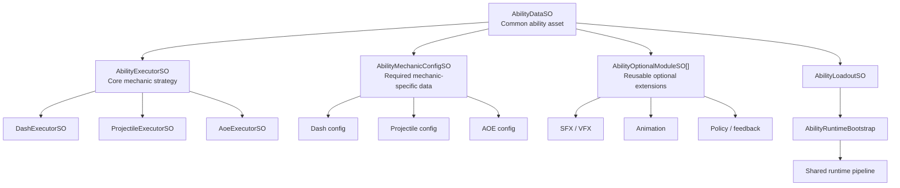
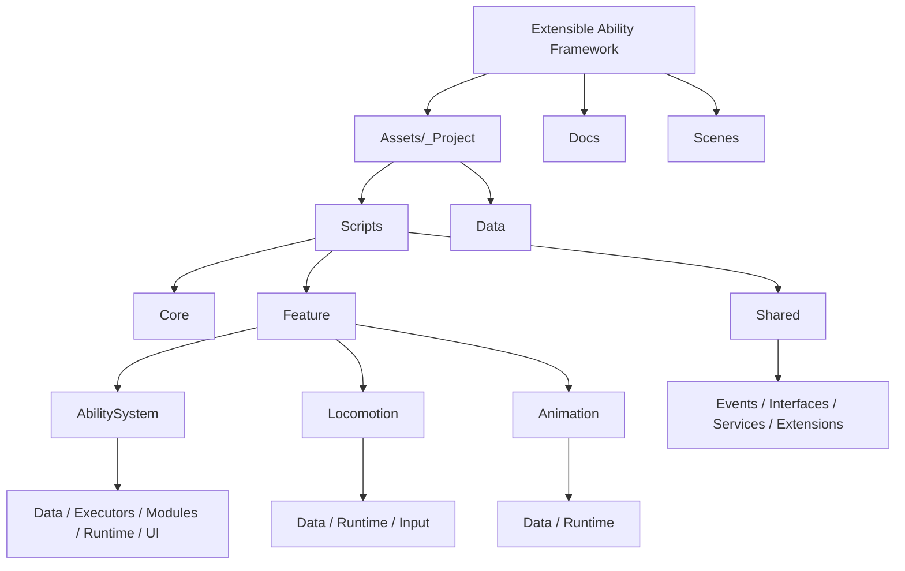

# Extensible Ability Framework

Extensible Ability Framework is a feature-oriented Unity sample project built around modular gameplay systems.
At its core is a data-driven ability pipeline, while locomotion, animation, HUD, and feedback flows remain separated behind the same architectural rules.

This repository is intended to demonstrate extensibility, clean responsibility boundaries, and a production-minded authoring workflow.
The README focuses on the project-level architectural decisions and design patterns that shaped the implementation.

## Case Focus: Extensible Ability System

This case is centered on building an extensible ability framework, not a content-complete game loop.
The primary value is the ability pipeline and its authoring model:

- One root ability asset (`AbilityDataSO`) for each skill
- Executor-driven mechanic strategy (`AbilityExecutorSO`)
- Mechanic-specific required payload (`AbilityMechanicConfigSO`)
- Optional, composable behavior extensions (`AbilityOptionalModuleSO`)
- Event-driven runtime flow to HUD and animation without direct feature coupling

## Overview

Core focus areas of the project:

- Data-driven ability authoring
- Feature-based folder and scope separation
- Dependency-injected runtime composition
- Event-driven communication between features
- Mobile-conscious pooling and allocation control
- Minimal runtime code changes when adding new ability variants

## Highlights

- Single-entry ability authoring through `AbilityDataSO`
- Dedicated executors for Dash, Projectile, and AOE mechanics
- Shared energy and cooldown flow with HUD integration
- Hit feedback pipeline: flash, scale, bounce, and hit VFX
- Pool-based spawning for projectiles and visual effects
- Player locomotion lock and animation integration
- Foldable inspector workflow with built-in validation
- Optional module rows show Runs At execution-stage badges in the inspector

## Architecture Snapshot

Instead of concentrating gameplay logic inside a few large scripts, the project separates responsibilities by feature:

- `Ability System`
  - Triggering, validation, cooldown, energy, execution, and feedback
- `Locomotion`
  - Rigidbody-based movement, turning, dead-zone handling, and lock control
- `Animation`
  - Stable transfer of motion data into animator parameters
- `Shared`
  - Pooling, event contracts, and common services

Runtime composition is handled with `VContainer`, while cross-feature communication is routed through `MessagePipe` events.

## Why This Structure

The goal was not only to build a working demo, but to establish a foundation that can grow without turning into a tightly coupled gameplay script cluster.

In practice this means:

- A new ability variant should usually be introduced by creating a new asset.
- A new mechanic should require a new `executor`, and only when necessary a new module.
- HUD, animation, and runtime execution should not depend on each other directly; they communicate through explicit contracts.

This keeps both the authoring workflow and long-term maintenance more predictable.

## Architectural Decisions

- `Feature-based structure` was chosen so ability, locomotion, and animation can evolve independently, reducing the chance that a change in one area breaks another.
- `Dependency Injection (VContainer)` was used to keep scene-side UI/input wiring and player-prefab runtime systems explicitly composed instead of relying on hidden dependencies.
- `Event-driven communication (MessagePipe)` was preferred so HUD, animation, input, and execution layers stay loosely coupled while still reacting to the same runtime state.
- `Data-driven authoring` was adopted so most new ability variants can be added as content, while runtime code is only extended when a genuinely new mechanic is introduced.
- `Object pooling` was treated as a baseline requirement to avoid repeated instantiate/destroy cycles for projectiles and VFX, especially with mobile performance in mind.
- `Single asset ability authoring` was selected so mechanic config and optional modules live under the same `AbilityDataSO`, reducing authoring friction and keeping asset-level changes easier to review.

## Design Patterns

- `Strategy`: each ability's core behavior is defined by the selected `AbilityExecutorSO`, allowing Dash, Projectile, and AOE mechanics to share the same runtime pipeline.
- `Factory`: `AbilityFactory` centralizes runtime `IAbility` creation so instantiation rules do not leak into loadout or bootstrap code.
- `Observer / Pub-Sub`: cooldown, energy, trigger, and loadout updates are broadcast through events, allowing UI, animation, and gameplay systems to stay synchronized without direct references.
- `Template / Hook`: the optional module model injects behavior into `before/after execute` stages, making it possible to extend execution with SFX, VFX, or policy logic without rewriting the main flow.
- `Object Pool`: projectile and VFX instances are reused through shared pooling infrastructure to keep runtime allocation pressure low.

## Creating a New Ability

One of the main goals of the project is to make new ability creation predictable.
The intended workflow is:

1. Create a new `AbilityDataSO`.
2. Select an `AbilityExecutorSO` based on the mechanic type.
3. Create the required `AbilityMechanicConfigSO` sub-asset for that executor.
4. Add optional modules only for non-essential extensions such as feedback or auxiliary policies.
5. Add the ability to the loadout in the desired slot order.
6. Assign that `AbilityLoadoutSO` to the player-side `AbilityRuntimeBootstrap`.
7. Let the existing runtime pipeline handle triggering, validation, execution, cooldown, energy, HUD, and animation events.

This separation is intentional:

- `Executor` defines the core mechanic.
- `MechanicConfig` stores the executor-specific required data.
- `Optional Modules` add behavior that should remain optional and composable.

As a rule of thumb:

- `New content variant`: create a new `AbilityDataSO`
- `New mechanic`: create a new executor and mechanic config
- `New optional behavior`: create a new module

## Ability Authoring Model

The same `AbilityDataSO` remains the root authoring asset for every ability.
What changes from ability to ability is the selected executor, the required mechanic config for that executor, and the set of optional modules attached to the asset.

This is the key extensibility rule in the project:

- `AbilityDataSO` stays stable as the common entry point.
- `AbilityExecutorSO` can change when the mechanic changes.
- `AbilityMechanicConfigSO` changes with the executor because it stores required mechanic-specific data.
- `AbilityOptionalModuleSO` instances stay reusable and composable across multiple abilities.

## Current Feature Set

### Ability System

- `AbilityDataSO`-centered authoring model
- `Executor + MechanicConfig + OptionalModule` separation
- Loadout-to-HUD mapping based on slot order
- Shared energy and cooldown state
- Domain and presentation event separation

Detailed documentation:
- [Ability System Docs](Docs/Features/AbilitySystem.md)

### Locomotion

- Rigidbody-based movement
- Cached input and fixed-tick execution
- Ability-driven movement lock integration

Detailed documentation:
- [Locomotion Docs](Docs/Features/Locomotion.md)

### Animation

- Stable movement parameter updates
- Animator integration for ability trigger, slot index, and playback speed
- Clip override flow based on loadout slots

Detailed documentation:
- [Animation Docs](Docs/Features/Animation.md)

## Technical Documentation

In addition to this presentation-oriented README, the repository includes more detailed technical references:

- [Technical README](TECHNICAL_README.md)
- [Ability Feature Scope](Docs/AbilityFeatureScope.md)
- [Ability System Docs](Docs/Features/AbilitySystem.md)
- [Locomotion Docs](Docs/Features/Locomotion.md)
- [Animation Docs](Docs/Features/Animation.md)
- [Smoke Checklist](Docs/SmokeChecklist.md)

## Project Structure

Top-level structure:

- `Assets/_Project/_Scripts/Core`
  - Root composition and shared setup
- `Assets/_Project/_Scripts/Feature`
  - Gameplay features such as Ability, Locomotion, and Animation
- `Assets/_Project/_Scripts/Shared`
  - Infrastructure used by more than one feature
- `Assets/_Project/Data`
  - Authoring assets

This structure keeps feature code and shared infrastructure separate, making the repository easier to navigate and extend.

For a more detailed structure diagram:
- [Project Structure Docs](Docs/ProjectStructure.md)

## Demo Video

- Video: [Gameplay Demo](https://github.com/your-org/your-repo/assets/your-demo-video-id)
- Note: Replace the placeholder link above with the final uploaded demo URL.

## Running The Project

1. Open the project in Unity Hub with version `6000.3.8f1`.
2. Load `Assets/_Project/Scenes/Gameplay.unity`.
3. Verify that the scene and player scope hierarchy is active.
4. Enter Play Mode and test the ability, HUD, locomotion, and animation flow.

## Notes

- This repository is a technical gameplay framework sample rather than a content-complete game.
- More detailed rationale behind the implementation is documented in `TECHNICAL_README.md`.
- Validation has been primarily manual; fast verification steps are listed in `Docs/SmokeChecklist.md`.

