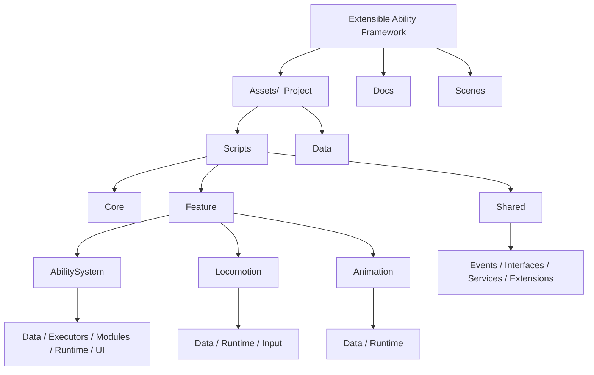

# Extensible Ability Framework

Extensible Ability Framework, Unity icinde modul bazli gameplay sistemleri kurmak icin hazirlanmis, feature-odakli bir ornek projedir.
Merkezde data-driven bir ability pipeline bulunur; locomotion, animation, HUD ve feedback akislari ayni mimari ilkelere bagli kalacak sekilde ayrik tutulur.

Bu repo, kod kalitesi kadar genisletilebilirlik, sorumluluk ayrimi ve yeniden kullanilabilir authoring akisini gostermeyi hedefler.

## Overview

Projede odaklanan ana basliklar:

- Data-driven ability authoring
- Feature-based klasorleme ve scope ayrimi
- DI tabanli runtime composition
- Event-driven feature iletisimi
- Mobil dostu pooling ve allocation farkindaligi
- Yeni ability varyanti eklerken mevcut runtime koduna minimum temas

## Highlights

- Tek bir `AbilityDataSO` uzerinden ability authoring
- Dash, Projectile ve AOE icin ayri executor katmani
- Ortak enerji/cooldown sistemi ve HUD entegrasyonu
- Hit visual feedback akisi: flash, scale, bounce, hit vfx
- Projectile ve VFX icin pool tabanli spawn sistemi
- Player locomotion lock ve animation entegrasyonu
- Foldable inspector ve validation destekli authoring akisi

## Architecture Snapshot

Bu proje, klasik "tek scriptte tum gameplay" yaklasimi yerine sorumluluklari feature bazinda ayirir:

- `Ability System`
  - Tetikleme, validation, cooldown, energy, execution, feedback
- `Locomotion`
  - Rigidbody tabanli hareket, donus, dead-zone, lock kontrolu
- `Animation`
  - Hareket verisinin animator parametrelerine stabil aktarimi
- `Shared`
  - Pooling, event kontratlari ve ortak servisler

Runtime baglantilari `VContainer` ile kurulur, feature'lar arasi haberlesme ise `MessagePipe` event'leri ile yapilir.

## Why This Structure

Bu yapida hedeflenen sey sadece calisan bir demo degil, yeni gereksinim geldiginde kirilmadan buyuyebilen bir temel sunmaktir.

Ornek olarak:

- Yeni bir ability varyanti icin cogunlukla yeni asset yeterlidir.
- Yeni bir mekanik gerekiyorsa yeni `executor` ve gerekliyse yeni module tanimlanir.
- HUD, animation ve runtime execution dogrudan birbirine baglanmaz; event kontratlari uzerinden haberlesir.

Bu sayede hem authoring akisinda hem de kod bakiminda daha kontrollu bir yapi elde edilir.

## Current Feature Set

### Ability System

- `AbilityDataSO` merkezli authoring modeli
- `Executor + MechanicConfig + OptionalModule` ayrimi
- Slot sirasina dayali loadout ve HUD eslesmesi
- Shared energy ve cooldown state
- Domain ve presentation event ayrimi

Detayli teknik dokuman:
- [Ability System Docs](Docs/Features/AbilitySystem.md)

### Locomotion

- Rigidbody tabanli hareket
- Input cache + fixed tick akisi
- Ability kaynakli movement lock entegrasyonu

Detayli teknik dokuman:
- [Locomotion Docs](Docs/Features/Locomotion.md)

### Animation

- Stabil hareket parametre aktarimi
- Ability trigger/index/speed animator entegrasyonu
- Loadout slotlarina gore clip override akisi

Detayli teknik dokuman:
- [Animation Docs](Docs/Features/Animation.md)

## Technical Documentation

Sunum odakli bu README'ye ek olarak daha ayrintili teknik referanslar repo icinde tutulur:

- [Technical README](TECHNICAL_README.md)
- [Ability Feature Scope](Docs/AbilityFeatureScope.md)
- [Ability System Docs](Docs/Features/AbilitySystem.md)
- [Locomotion Docs](Docs/Features/Locomotion.md)
- [Animation Docs](Docs/Features/Animation.md)
- [Smoke Checklist](Docs/SmokeChecklist.md)

## Project Structure

Ana klasorleme mantigi:

- `Assets/_Project/_Scripts/Core`
  - Ortak kurulum ve root composition
- `Assets/_Project/_Scripts/Feature`
  - Ability, Locomotion, Animation gibi oyun feature'lari
- `Assets/_Project/_Scripts/Shared`
  - Birden fazla feature tarafindan kullanilan ortak altyapi
- `Assets/_Project/Data`
  - Authoring asset'leri

Bu yapi, feature kodunu ve ortak altyapiyi birbirinden ayirarak repo icinde gezinmeyi kolaylastirir.

Daha detayli yapi diyagrami:
- [Project Structure Docs](Docs/ProjectStructure.md)

## Running The Project

1. Unity Hub ile projeyi `6000.3.8f1` surumunde acin.
2. `Assets/_Project/Scenes/Gameplay.unity` sahnesini yukleyin.
3. Scene ve player altindaki scope hiyerarsisinin aktif oldugunu dogrulayin.
4. Play mode'da ability, HUD, locomotion ve animation akisini test edin.

## Notes

- Proje, teknik degerlendirme odakli bir gameplay framework ornegidir; tam oyun icerigi hedeflemez.
- Teknik kararlarin ayrintili gerekceleri `TECHNICAL_README.md` dosyasinda tutulur.
- Manuel test odakli ilerlenmistir; hizli dogrulama adimlari `Docs/SmokeChecklist.md` icindedir.
